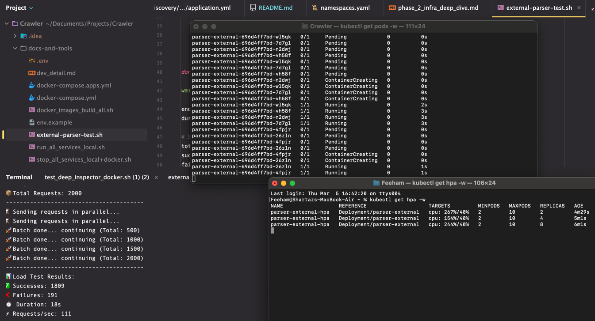

# 🕸️ Architecting web crawler simulation
This project is made for business-simple, architecture + deployment focused learning. 
The concept is simple: Its a Crawler simulator, the `Url discovery` service discovers multiple url and publish them to `Kafka`.
Then the `Processor` service consumes them, saves to `Database` as pending. Outbox (`Debezium`) reads those and publish to Kafka. 
`Fetcher` service consumes those and call `Parser` service (which is treated as external service) to parse url page data 
and `Sensor` service for statistics and censorship. On responses return, the fetcher service publish to Kafka. Processor service 
consumes fetcher result, do its processing and updates into DB. Also it exposes an endpoints to see processed data. 
<hr>

## 🧩 Services with structural details

### 🔍 Url discovery 
- Trigger URL Generation: POST /api/v1/discovery/generate?count=N
- Max limit of N: 100000
- Deployment env required: 
  - `KAFKA_URL`: Kafka bootstrap servers
  - `KAFKA_TOPIC_DISCOVERY_URLS`: Topic name for discovered URLs

The entry point of the simulation that generates a unique process ID and N random product URLs upon request. It serves as the primary load generator by publishing discovery events to Kafka, allowing the system to be stressed with large batches of concurrent crawl tasks.

### 🧠 Processor
- Get all records: GET /api/v1/processor/records
- Get records by process ID: GET /api/v1/processor/records/{processId}
- Deployment env required: 
  - `DB_URL`: Postgres JDBC URL
  - `DB_USER`: Database username
  - `DB_PASSWORD`: Database password
  - `KAFKA_URL`: Kafka bootstrap servers
  - `KAFKA_TOPIC_DISCOVERY_URLS`: Consuming topic (from Discovery)
  - `KAFKA_TOPIC_FETCHER_RESULTS`: Consuming topic (from Fetcher)

The central orchestrator and state manager of the crawler. It persists newly discovered URLs into PostgreSQL as pending tasks and maintains the source of truth for the entire lifecycle. It eventually consumes crawl results from Kafka to update database records with metadata and status.

### 🚀 Fetcher 
- Deployment env required: 
  - `KAFKA_URL`: Kafka bootstrap servers
  - `PARSER_URL`: URL of the External Parser service
  - `SENSOR_URL`: URL of the Sensor service
  - `KAFKA_TOPIC_FETCHER_RESULTS`: Topic name to publish combined results
  - `KAFKA_TOPIC_PUBLIC_CRAWL_RECORDS`: Topic for public stream records

The high-concurrency worker service that pulls URLs from the event bus and performs the actual crawl simulation. It coordinates parallel calls to the internal Sensor and external Parser services to aggregate page data and safety flags before emitting a consolidated result back to the event bus.

### 📄 Parser (External)
- Process URL: POST /api/v1/parser/process
- Deployment env required: 
  - `PARSER_JITTER_MIN`, `PARSER_JITTER_MAX`: Latency simulation range
  - `PARSER_FAIL_RATE`: Simulation of service failure (0.0 to 1.0)

A simulated third-party parsing utility designed to mimic real-world network dependencies. It provides highly configurable environment variables to simulate artificial latency and failure rates, enabling the testing of system resilience and autoscaling behavior under unstable conditions.

### 📡 Sensor
- Inspect URL: POST /api/v1/sensor/inspect
- Deployment env required: 
  - `SENSOR_JITTER_MIN`, `SENSOR_JITTER_MAX`: Latency simulation range
  - `SENSOR_FAIL_RATE`: Simulation of service failure
  - `SENSOR_CENSORSHIP_RATE`: Simulation of censorship detection

A utility service used for content safety and statistical inspection during the fetch phase. It simulates processing overhead and returns randomized censorship or safety flags based on configured rates, allowing the system to simulate compliance and data filtering logic.

### 🛣️ Kafka
- Core infrastructure: Apache Kafka Event Bus
- Key Topics: `crawler.discovery.urls`, `crawler.fetcher.results`, `crawler.public.crawl_records`

The central nervious system of the architecture that decouples services and enables asynchronous communication. It ensures that URL discoveries and crawl results are reliably passed between the orchestrator and workers, supporting massive scale by buffering events during traffic spikes.

### 📬 Debezium
- Mechanism: Change Data Capture (CDC) / Outbox Pattern
- Deployment: Connectors monitoring PostgreSQL WAL (Write Ahead Log)

Implements the Outbox pattern to ensure transactional integrity between database updates and event publishing. It watches the Processor's database for new pending records and automatically streams them into Kafka, guaranteeing that no crawl task is lost even if the application crashes during a write.
<hr>

## 🛠️ Dev tools
All utility scripts and configurations are located in the `docs-and-tools` directory to streamline development and deployment.

### Local & Infrastructure Management
- `docker-compose.yml`: Manages the core infrastructure (Kafka, Postgres, Zookeeper) required for the system.
- `docker-compose.apps.yml`: Orchestrates all crawler microservices in a containerized environment for full-stack testing.
- `run_all_services_local.sh`: Automates the sequential Maven build and background execution of all Spring Boot services on the local machine.
- `stop_all_services_local+docker.sh`: Performs a clean teardown of local Java processes and releases bound ports.

### Automation & Testing
- `docker_images_build_all.sh`: Handles building, tagging, and pushing all service Docker images to the registry.
- `test_deep_inspector_local.sh` / `_docker.sh`: End-to-end validation scripts that verify the flow from discovery to final processing.

### Kubernetes & Scaling Validation
- `test_k8s.sh`: The **Main Management Console**. Provides a menu-driven interface for Helm upgrades, deep cleans, cluster status monitoring, and end-to-end pipeline testing.
- `external-parser-test.sh`: A specialized stress-testing utility used to hit the public Ingress URL with massive parallel load. Its primary purpose is to trigger and verify Kubernetes Horizontal Pod Autoscaling (HPA) by saturating pod resources.
<hr>

## 🚢 Deployment (External)
Focuses on the high-availability distribution of the Parser service. This deployment serves as a blueprint for external service integration, featuring dynamic scaling, environment-aware configuration, and ingress-based networking.

### 📂 Folder: `k8s/helm/external`
The heart of the external service distribution, structured for multi-environment reliability.

- **`Chart.yaml`**: Contains the chart metadata, defining the **application version** and **helm chart naming** for registry indexing.
- **`values.yaml`**: The primary configuration source. Defines base `image` details, default `service.port`, and `parserSettings` like `jitterMin` and `failRate`.
- **`values-test.yaml`**: A specialized profile for local load tests. Swaps `springProfile` to `prod` and increases `resources.limits` to handle burst traffic during local stress tests.
- **`values-prod.yaml`**: The production-ready config. Enables `autoscaling` with a `maxReplicas` of 10 and enforces strict `resources.requests` for stability on the Mac mini cluster.

### 📂 Folder: `templates/`
Core Kubernetes manifest blueprints that consume values for final rendering.

- **`deployment.yaml`**: The main workload spec. Injects environment variables like `SPRING_PROFILES_ACTIVE` and sets up `livenessProbe` and `readinessProbe` to ensure zero-downtime updates.
- **`service.yaml`**: An abstraction layer that maps external traffic to the actual `containerPort` defined in the specific environment profile.
- **`ingress.yaml`**: Configures the **Nginx Ingress Controller** to route traffic from the host `parser.external.public.url` to the internal service.
- **`hpa.yaml`**: Scales the pod count dynamically between `minReplicas` and `maxReplicas` based on the `targetCPUUtilizationPercentage` (currently calibrated to `40%`).

### 💻 Commands
Deployment and management utilities for the external parser service.

Create the required namespaces for the crawler ecosystem:
```bash
  kubectl apply -f k8s/namespaces.yaml
```

Install or upgrade the external parser chart with production values:
```bash
  helm upgrade --install parser-external ./k8s/helm/external -f ./k8s/helm/external/values-prod.yaml -n crawler-external
```

Monitor the status of pods and their distribution:
```bash
  kubectl get pods -n crawler-external -l app=parser-external -w
```

Check the active Horizontal Pod Autoscaler and scaling metrics:
```bash
  kubectl get hpa parser-external -n crawler-external -w
```

Inspect the ingress rules and public host mapping:
```bash
  kubectl get ingress parser-external -n crawler-external
```

View real-time logs for a specific parser pod:
```bash
  kubectl logs -n crawler-external -l app=parser-external -f
```

Completely remove the external parser deployment:
```bash
  helm uninstall parser-external -n crawler-external
```

## 🚢 Deployment (Crawler)
The internal workloads, covering stateful infrastructure (Kafka, Postgres) and stateless web services.

### 🏗️ Infrastructure (`crawler-infra`)
This chart handles the deployment of Postgres, Zookeeper, Kafka, Kafkadrop, and Debezium. It uses explicit manifests (no conditionals) to guarantee all components spin up synchronously. It includes a specialized `configurator` sidecar container that actively polls the Debezium REST API and injects the Postgres CDC configuration once the server is ready.

#### 💻 Commands (Infrastructure)

**1. Local Development (Default Values)**
Tuned for a local Mac environment with 16GB of RAM. Provides enough JVM heap to run smoothly without overheating.
```bash
  helm upgrade --install infra-test ./k8s/helm/infra -n crawler-infrastructure
```

**2. AWS Free Tier (Aggressive Constraints)**
Extremely aggressive constraints intended to squeeze the entire stack onto a 1GB AWS `t2.micro` instance. Sets Kafka to 1 replica and crushes JVM heaps to `128M`. *(Note: High probability of OOM Kills).*
```bash
  helm upgrade --install infra-test ./k8s/helm/infra -f ./k8s/helm/infra/values-aws-free-tier.yaml -n crawler-infrastructure
```

**3. Enterprise Production (HA Cluster)**
True enterprise-grade HA cluster. Provisions 5 Kafka brokers, massive 1TB persistent storage volumes, and 16GB RAM constraints per pod.
```bash
  helm upgrade --install infra-test ./k8s/helm/infra -f ./k8s/helm/infra/values-prod.yaml -n crawler-infrastructure
```

Verify that the Infrastructure pods are running:
```bash
  kubectl get pods -n crawler-infrastructure -w
```

Connect to the Postgres database directly from within the pod:
```bash
  kubectl exec -it crawler-pg-db-0 -n crawler-infrastructure -- psql -U user -d crawler_db
```
*(When prompted for a password, enter: `password`)*

Access the **Kafkadrop UI** by adding the Ingress host to your local machine's `/etc/hosts` file:
```text
  127.0.0.1 kafka.crawler.public.url
```

### ⛵ Crawler Applications (`crawler-apps`)
This chart deploys the core business logic: `url-discovery`, `processor`, `fetcher`, and `sensor`. It is designed to be deployed after the infrastructure is ready.

#### 💡 Key Features:
- **Resilience:** Configured with specific failure rates (e.g., 5% sensor failure, 10% parser failure) to simulate real-world conditions.
- **Dynamic Scaling:** Includes Horizontal Pod Autoscalers (HPA) for all services to handle spikes in URL generation.
- **Optimized Routing:** The `fetcher` service is configured to call the `parser-external` via its Nginx Ingress link, ensuring realistic external service simulation.

#### 💻 Commands (Applications)
```bash
  # Install or upgrade the crawler applications
  helm upgrade --install crawler-apps ./k8s/helm/apps -n crawler-apps
```

Verify the application status using the management console:
```bash
  ./docs-and-tools/test_k8s.sh
```
*(Choose Option 4 to see pod health and HPA metrics)*


Tested the external parser system using `external-parser-test.sh`. Its auto scaling is working fine on high load. 
