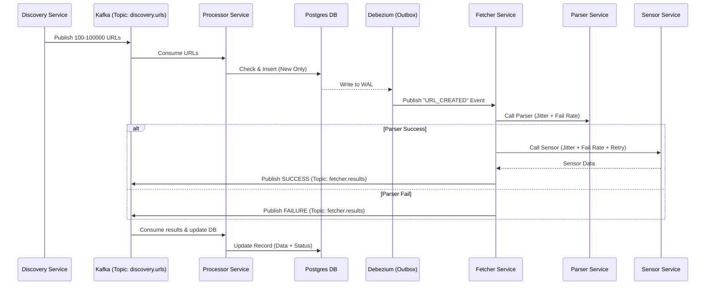

# Crawler System - Architectural Detail

This document outlines the architectural design and implementation details for the distributed Crawler system. The focus is on architectural beauty, scalability, and robust event-driven communication.

## 1. System Overview

The system is a distributed microservices-based crawler that follows the **Transactional Outbox Pattern** for reliable event delivery and uses **Kafka** as the primary message backbone.

### Core Services
1.  **URL Discovery Service**: Generates potential targets.
2.  **Processor Service**: Managed the source of truth (Database) and handles duplicate detection/updates.
3.  **Fetcher Service**: Orchestrates the parsing and sensing logic with retry capabilities.
4.  **Parser (External) Service**: Simulates HTML/Data parsing with configurable noise (treated as an external third-party service).
5.  **Sensor (Mock) Service**: Simulates site health/availability checks.

---

## 2. Shared Data Standards

-   **IDs**: All primary identifiers must be of type `Long` (no UUIDs).
-   **Communication**: Asynchronous via Kafka for high-throughput flows; Synchronous REST for external service calls (Parser/Sensor).

---

## 3. Event Infrastructure

The system relies on a high-availability event backbone for all asynchronous communication.

-   **Confluent Kafka**: The core message broker for handling `URL_DISCOVERED`, `URL_CREATED`, and `fetcher.results`.
-   **Zookeeper**: Provides coordination and state management for the Kafka cluster.
-   **Kafkadrop**: Web UI for monitoring topics, consumer groups, and message flows.

---

## 4. Detailed Service Breakdown

### A. URL Discovery Service
-   **Responsibility**: Generating seed URLs for the crawler.
-   **Endpoint**: `POST /api/v1/discovery/generate` 
    -   **Payload**: `{ "count": 500 }` (optional, default 100, max 100000).
-   **Logic**:
    -   Generates `N` realistic URLs (e.g., `https://ecommerce.com/products/item-123`).
    -   Assigns a unique **Process ID** (Long) to the batch.
    -   Publishes a `URL_DISCOVERED` event to Kafka topic `discovery.urls` for each URL.
    -   Returns the **Process ID** to the caller.

### B. Processor Service
-   **Responsibility**: Single source of truth for URL state and data.
-   **Database**: PostgreSQL (or similar relational DB).
-   **Flow 1 (Ingestion)**:
    -   Consumes from `discovery.urls`.
    -   Checks DB for duplicate URLs.
    -   If new: Saves to `crawl_records` table with status `PENDING`.
-   **Flow 2 (Update)**:
    -   Consumes from `fetcher.results`.
    -   Updates the record with parsing data and sensor metrics.
    -   Sets status to `COMPLETED` or `FAILED`.
-   **Outbox Pattern**:
    -   Uses **Debezium** to tail the DB transaction log (WAL).
    -   Publishes `URL_CREATED` events to `processor.outbox.urls` whenever a new record is inserted.

### C. Fetcher Service
-   **Responsibility**: Orchestration and Resiliency.
-   **Flow**:
    1.  Consumes from `processor.outbox.urls`.
    2.  **Call Parser**:
        -   `POST /api/v1/parser/process`
        -   Jitter: 100-1000ms.
        -   Failure Rate: 25% (No retries).
    3.  **Call Sensor** (Only if Parser succeeds):
        -   `POST /api/v1/sensor/inspect`
        -   Jitter: 100-300ms.
        -   Failure Rate: 25%.
        -   **Retry Strategy**: 1 retry on Sensor failure.
    4.  **Result Propagation**:
        -   Publishes `SUCCESS` or `FAILURE` event to `fetcher.results` with all collected data.

### D. Mock Services (Parser & Sensor)
-   **Parser Service**:
    -   Returns: JSON with 5-10 realistic fields (e.g., `pageTitle`, `pageMetaTags`, `pageMetaDescription`, `contentSize`, `normalizedContents`, `popularity`), etc. 
-   **Sensor Service**:
    -   Returns: SSL status, Server latency, and Site availability and most importantly the conntent sensorship (true or false), 25% false - meaning prohibited content. 

---

## 5. Endpoint Definitions (Total 4)

| Service       | Method | Path                             | Description                                 |
| :------------ | :----- | :------------------------------- | :------------------------------------------ |
| **Discovery** | `POST` | `/api/v1/discovery/generate`     | Trigger URL generation (returns Process ID) |
| **Parser**    | `POST` | `/api/v1/parser/process`         | External parsing logic                      |
| **Sensor**    | `POST` | `/api/v1/sensor/inspect`         | Mock sensing logic                          |
| **Processor** | `GET`  | `/api/v1/processor/records/{id}` | View all results for a specific Process ID  |

---

## 6. Configurable Parameters

| Parameter             | Default Value | Description                       |
| :-------------------- | :------------ | :-------------------------------- |
| `parser.jitter.min`   | 100ms         | Minimum delay for parser response |
| `parser.jitter.max`   | 1000ms        | Maximum delay for parser response |
| `parser.fail.rate`    | 0.25          | Probability of Parser failure     |
| `sensor.jitter.min`   | 100ms         | Minimum delay for sensor response |
| `sensor.jitter.max`   | 300ms         | Maximum delay for sensor response |
| `sensor.fail.rate`    | 0.25          | Probability of Sensor failure     |
| `discovery.max.count` | 100000        | Maximum URLs per request          |

---

## 7. Event Logic Diagram

---

## 8. Production Infrastructure & Deployment

The system is designed for a cloud-native deployment on AWS using standard enterprise tooling.

### A. Cloud & Data Layer
-   **AWS RDS (PostgreSQL)**: Scalable, managed relational database.
    -   *Logical Replication*: Required for Debezium to capture changes.
    -   *Connectivity*: Processor service connects via IAM-based authentication or secret-managed credentials.

### B. Orchestration & Packaging
-   **Kubernetes (Local/EKS)**: The primary execution environment for all microservices.
-   **Helm**: Used for granular deployment management via three main components:
    -   `crawler-infra`: Shared resources (Postgres, Redis, Kafka).
    -   `crawler-apps`: Core business logic (Discovery, Processor, Fetcher, Sensor).
    -   `external-parser`: Treated as a "different world" service in a separate namespace.

### C. Namespace Isolation
-   `crawler-system`: Contains all internal crawler components and infrastructure.
-   `external-services`: Contains the Parser service, completely isolated from the crawler's internal networking logic except via standard cluster-local DNS (`parser.external-services.svc.cluster.local`).

### D. Deployment Flow
1.  **Namespace Creation**: Setup `crawler-system` and `external-services`.
2.  **Infra Layer**: Deploy StatefulSets for Postgres and Deployments for Kafka/Redis.
3.  **App Layer**: Deploy microservices with structured liveness/readiness probes.
4.  **External Layer**: Deploy the Parser in its unique operational silo.

---

## 9. Deployment Profiles

The system supports two primary operational profiles to bridge the gap between development and production.

### A. Dev Profile (`dev`)
-   **Environment**: Local developer workstation.
    -   **Orchestration**: Docker Compose.
    -   **Database**: Containerized PostgreSQL.
    -   **Kafka**: Local Confluent Kafka + Zookeeper containers.
    -   **Monitoring**: Kafkadrop accessible via `localhost`.
    -   **Configuration**: Optimized for fast feedback loops and debugging.

### B. Prod Profile (`prod`)
-   **Environment**: AWS / Cloud-native.
    -   **Orchestration**: Kubernetes (EKS) managed via Helm.
    -   **Database**: AWS RDS (PostgreSQL) with Logical Replication.
    -   **Kafka**: Dedicated Confluent Kafka cluster.
    -   **Service Mesh**: Istio enabled with mTLS and observability sidecars.
    -   **Ingress**: Nginx Ingress Controller for secure, public-facing endpoints.
    -   **Configuration**: Scaled for high availability and strict security.
---

## 10. Automation & Tooling

The system includes a suite of scripts for seamless lifecycle management.

### A. Lifecycle Scripts (`run_all.sh` / `stop_all.sh`)
-   **`run_all.sh`**: 
    -   Starts all infrastructure (Kafka, Postgres, Zookeeper).
    -   Builds and starts all microservices (Processor, Discovery, Fetcher, etc.).
    -   Supports `restart` flag to wipe state and reboot.
-   **`stop_all.sh`**: Gracefully shuts down all containers and removes networks.

### B. Verification Tooling (`test-runner.sh`)
-   **Execution Flow**:
    1.  Hits `POST /api/v1/discovery/generate` (using default count).
    2.  Captures the returned **Process ID**.
    3.  Sleeps for a **10-second** jitter wait.
    4.  Hits `GET /api/v1/processor/records/{processId}`.
    5.  Validates that all generated URLs have been processed and stored with enrichment data.

---

## 11. Containerization & Build Automation

To ensure cross-platform consistency (Mac/Linux/Windows) and deployment readiness, all services are containerized using optimized multi-stage Docker builds.

### A. Docker Optimization
- **Base Image**: `eclipse-temurin:21-jre-alpine` (Minimal footprint, secure, and multi-arch).
- **Multi-Stage Build**: Separates the Maven build environment from the runtime environment to keep the final image size under 150MB.
- **Security**: Services run as a non-root `spring` user inside the container.
- **Caching**: Local Maven dependencies are cached during the build stage to speed up subsequent builds.

### B. Build Automation (`build_images.sh`)
The system includes an automated build script in `docs and infra/` that:
1. Cleans up existing service images.
2. Uses **Docker Buildx** to build universal images supporting both `amd64` (standard Linux/Windows) and `arm64` (Apple Silicon).
3. Tags images as `crawler-[service-name]`.

---

## 12. Observability & Configuration

A production-ready system must be visible and configurable via external sources of truth.

### A. Logging & Tracing
All microservices use **Logback** for granular logging. Files are saved in the `logs/` folder of each service root:
- **`all.log`**: Combined log stream.
- **`trace.log`**: `TRACE` level details (e.g., individual message IDs).
- **`debug.log`**: `DEBUG` level for troubleshooting.
- **`info.log`**: `INFO` level for business flow mapping.
- **`warn.log`**: `WARN` level for retries and jitter anomalies.
- **`error.log`**: Strictly `ERROR` level events (failures, exceptions).

### B. Caching Layer
The **Processor Service** implements a caching layer using **Redis** for the Retrieval API:
- **Endpoint**: `GET /api/v1/processor/records/{processId}`
- **TTL**: 30 seconds (configurable via `REDIS_CACHE_TTL` in `.env`).
- **Logic**: Reduces database load for repeated queries on a specific process batch.

### C. Environment & Secret Management
-   **Dev**: Local environment variables managed via `.env` files.
-   **Prod**: 
    -   **AWS Secrets Manager**: All sensitive data (DB passwords, Kafka credentials, Parser API keys) are fetched at runtime or injected via K8s secrets synchronized with AWS.
    -   **Centralized Config**: Non-sensitive configs (jitters, failure rates) are managed via K8s ConfigMaps.

---

## 12. Architectural Best Practices

To ensure "Architectural Beauty" and production stability, the following patterns are strictly enforced:

1.  **Idempotency**: The Processor service ensures that processing the same Kafka message multiple times (on retry) does not result in duplicate DB entries or inconsistent states.
2.  **Dead Letter Queues (DLQ)**: Failed Kafka messages (e.g., unparseable events) are routed to a `.dlq` topic for manual inspection rather than blocking the consumer.
3.  **Graceful Shutdown**: Services capture termination signals to finish current processing and close Kafka consumers/DB connections properly.
4.  **Liveness & Readiness Probes**: Kubernetes-native checks ensure traffic is only routed to healthy services and automatically restarts crashed instances.
5.  **Anti-Corruption Layer**: Proper DTO mappings between Kafka events and internal domain models to prevent leaking infrastructure details into the business logic.
